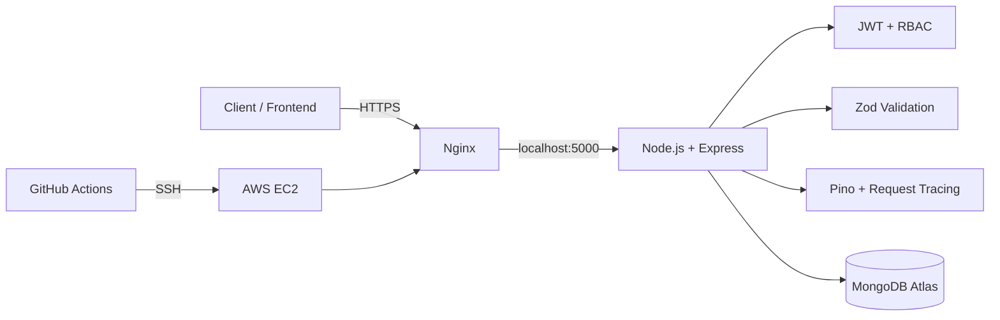

# Student Management System API

A secure, cloud-ready REST API for student registration, attendance and academic records, built with Node.js, Express and MongoDB.

## Tech stack
- Node.js 20+
- Express.js 5
- MongoDB + Mongoose
- MongoDB Atlas for managed production persistence
- RESTful API + MVC architecture
- JWT authentication + role-based authorization (`admin`, `teacher`)
- bcrypt password hashing
- Zod request validation with strict schemas
- Pino + pino-http structured logging and request tracing
- OpenAPI 3.0 + Swagger UI
- Helmet, CORS and rate limiting
- Docker + Docker Compose
- AWS EC2 deployment
- Nginx reverse proxy + HTTPS/Certbot
- GitHub Actions CI + AWS deployment workflow

## Features
- Teacher registration and JWT login
- Admin-only destructive operations
- Student registration, profile management, filtering and pagination
- Strict body, query and path validation with unknown-field rejection
- Attendance records with referential-integrity checks
- Daily attendance uniqueness through UTC-midnight normalization
- Academic records with automatic grade and SGPA calculation from marks
- Attendance and academic summary analytics per student
- Cascade cleanup of attendance and academic records when a student is deleted
- Database-aware health endpoint
- Correlation IDs via `x-request-id`
- Graceful SIGTERM/SIGINT shutdown with MongoDB disconnect
- Interactive API documentation at `/api-docs`
- JSON OpenAPI spec at `/api-docs.json`
- Unit/API tests plus MongoDB-backed integration tests
- Docker health checks
- Reproducible production environment configuration

## Production architecture



See [`docs/architecture.md`](docs/architecture.md) for the detailed deployment flow.

## Security model
- `POST /api/v1/*` and all `PATCH`/`DELETE` operations require `Authorization: Bearer <JWT>`.
- `DELETE` operations require the `admin` role.
- GET endpoints are intentionally public for this portfolio project; a production system handling real student PII should authorize reads as well.
- Passwords are never stored in plaintext.
- Zod schemas reject unknown request fields before controllers run, preventing accidental mass assignment.
- `JWT_SECRET` is mandatory and must be at least 32 characters in production.
- Secrets are supplied through environment variables and GitHub production secrets, never committed to source control.

## Project structure
```text
src/
├── config/          # environment, database and logging
├── controllers/     # business logic
├── docs/            # OpenAPI specification
├── middleware/      # auth, validation, tracing, health and errors
├── models/          # User, Student, Attendance and AcademicRecord
├── routes/          # REST endpoints
├── scripts/         # admin bootstrap utility
├── validators/      # strict Zod schemas
└── server.js        # startup and graceful shutdown

deploy/
├── ec2/             # EC2 bootstrap
└── nginx/           # reverse proxy and HTTPS setup

docs/                # architecture documentation
test/                # unit/API + MongoDB integration tests
```

## Run locally
```bash
npm install
cp .env.example .env
# Configure MONGODB_URI and JWT_SECRET in .env
npm test
npm run lint
npm start
```

API runs on `http://localhost:5000` by default.

## Authentication
Register a teacher:
```http
POST /api/v1/auth/register
Content-Type: application/json

{
  "name": "Aarav Sharma",
  "email": "aarav@example.com",
  "password": "strong-password-123"
}
```

Login:
```http
POST /api/v1/auth/login
Content-Type: application/json

{
  "email": "aarav@example.com",
  "password": "strong-password-123"
}
```

Use the returned token for protected writes:
```text
Authorization: Bearer <jwt>
```

### Create an admin
Admin accounts are bootstrapped from the server rather than exposed through public registration:
```bash
node src/scripts/createAdmin.js "System Admin" admin@example.com "strong-admin-password"
```

Never commit `.env`, passwords or JWT secrets.

## API documentation
After starting the application:
- Swagger UI: `http://localhost:5000/api-docs`
- OpenAPI JSON: `http://localhost:5000/api-docs.json`

## Endpoints
### Auth
- `POST /api/v1/auth/register` — creates a teacher account
- `POST /api/v1/auth/login` — returns a JWT

### Students
- `POST /api/v1/students` — teacher/admin
- `GET /api/v1/students` — public read
- `GET /api/v1/students/:id` — public read
- `PATCH /api/v1/students/:id` — teacher/admin
- `DELETE /api/v1/students/:id` — admin only; cascades related records
- `GET /api/v1/students/:id/attendance-summary`
- `GET /api/v1/students/:id/academic-summary`

### Attendance
- `POST /api/v1/attendance` — teacher/admin
- `GET /api/v1/attendance` — public read
- `GET /api/v1/attendance/student/:studentId` — public read
- `PATCH /api/v1/attendance/:id` — teacher/admin
- `DELETE /api/v1/attendance/:id` — admin only

### Academic records
- `POST /api/v1/academics` — teacher/admin
- `GET /api/v1/academics` — public read
- `GET /api/v1/academics/student/:studentId` — public read
- `PATCH /api/v1/academics/:id` — teacher/admin
- `DELETE /api/v1/academics/:id` — admin only

### Health
`GET /health` returns `200` with database status `connected` or `503` with database status `disconnected`.

## Docker
Local development with MongoDB:
```bash
JWT_SECRET='replace-with-a-long-random-secret-at-least-32-characters' docker compose up --build
```

Production uses `docker-compose.prod.yml` with MongoDB Atlas and does not expose port 5000 publicly; Nginx is the public reverse proxy.

## Testing and CI
```bash
npm test
npm run lint
```

CI starts a MongoDB 8 service and runs both the API/unit suite and MongoDB-backed integration tests before building the Docker image.

## AWS deployment

### 1. EC2
Create an Ubuntu EC2 instance and allow inbound TCP **80/443** in its security group. Keep port **5000 private**.

Run the bootstrap script:
```bash
bash deploy/ec2/bootstrap.sh
```

### 2. MongoDB Atlas
Create a production Atlas cluster, database user and network access rule for the EC2 public IP/VPC. Use the Atlas connection string as `MONGODB_URI`.

### 3. Production environment
Create `/opt/student-management-system-api/.env.production` using `.env.production.example` and set:
- `MONGODB_URI`
- `JWT_SECRET` (32+ random characters)
- `CORS_ORIGIN`
- `LOG_LEVEL`

Then:
```bash
cd /opt/student-management-system-api
docker compose -f docker-compose.prod.yml up -d --build
```

### 4. Nginx + HTTPS
Copy `deploy/nginx/student-api.conf` to the Nginx sites directory, replace `api.example.com` with the real API domain, then use Certbot:
```bash
sudo nginx -t
sudo systemctl reload nginx
sudo certbot --nginx -d api.example.com
sudo certbot renew --dry-run
```

### 5. GitHub Actions → AWS
The repository contains `.github/workflows/deploy-aws.yml`. Configure these **GitHub Actions production secrets**:

```text
EC2_HOST
EC2_USER
EC2_SSH_KEY
MONGODB_URI
JWT_SECRET
CORS_ORIGIN
```

After those secrets are configured, pushes to `main` can automatically deploy the latest Docker image to EC2. The workflow performs a hard reset to `origin/main`, writes the production environment file from GitHub secrets, rebuilds the container and removes unused Docker images.

### Important
The repository contains the complete AWS deployment configuration, but a live AWS deployment requires your own AWS account, EC2 instance, MongoDB Atlas cluster, DNS record and GitHub Actions secrets. Those credentials are intentionally not stored in this repository.

## Scope
This is a portfolio/learning project designed to demonstrate backend and cloud engineering practices. It is not presented as an enterprise-hardened production service.
