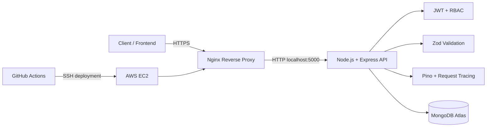

# Architecture

## Production architecture

## Runtime responsibilities

- **Nginx:** public entry point, TLS termination, reverse proxy and request forwarding.
- **Node.js/Express:** REST API, authentication, authorization, validation and business logic.
- **JWT/RBAC:** stateless authentication with `admin` and `teacher` roles.
- **MongoDB Atlas:** managed production persistence for users, students, attendance and academic records.
- **Pino/pino-http:** structured logs and correlation IDs using `x-request-id`.
- **GitHub Actions:** linting, unit/integration tests, Docker build and production deployment.
- **Docker:** reproducible application runtime on EC2.

## Production flow

1. A client calls the API over HTTPS.
2. Nginx terminates TLS and forwards the request to the container.
3. Express applies security headers, rate limiting, request tracing and route validation.
4. JWT authentication and role authorization protect write operations.
5. Controllers read/write MongoDB Atlas.
6. `/health` reports API and MongoDB connectivity for monitoring.
7. A push to `main` can trigger the AWS deployment workflow after the required GitHub production secrets are configured.
